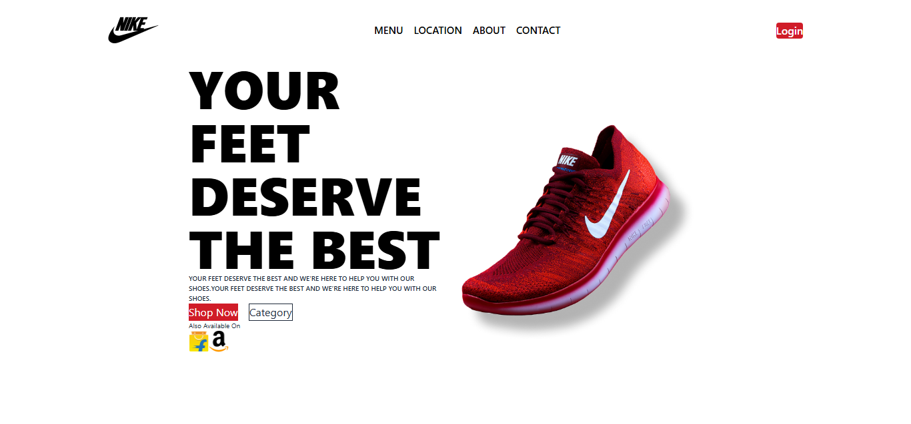

# Nike Show Website Landing Page Layout Clone

This cloning project shows the expertise of frontend development in React Vite, HTML, CSS, and JS component.


---

## 🌟 Overview
This project serves as my experience in frontend technologies. I have cloned a pixel perfect nike website landing page template from Figma to custom based code using react Vite framework.


## 🛠 Tech Stack
* **Frontend:** React.js (Functional Components)
* **Styling:** [e.g., Tailwind CSS / Styled Components / CSS Modules]
* **Animations:** [e.g., Framer Motion]

## 📸 Screenshots
| Desktop View |

|  | 

## 🚀 Installation & Setup
To run this project locally, follow these steps:

1. **Clone the repository:**
   ```bash
   git clone https://github.com/A-Nafis-Ch/Nike-Shoe-Website-Frontend-Clone.git
2. **Navigate to the directory:**
   ```bash
   cd Nike-Shoe-Website-Frontend-Clone
3. **Install dependencies:**
    ```bash
    npm install
4. **Start the development server:**
   ```bash
   npm run dev
